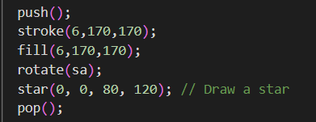
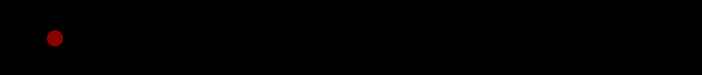

# HW05A

## Clock Star Animation

This project is a clock-inspired animation that visualizes time using geometric shapes. The clock is represented by rotating objects corresponding to seconds, minutes, and hours.

## How It Works

- **Seconds**: A star shape rotates with the progression of seconds.
- **Minutes**: A triangle rotates with the progression of minutes.
- **Hours**: A long, rounded rectangle rotates to represent the passing hours.
- The current time is determined using the `millis()` function to calculate seconds, minutes, and hours.

## problem I met in the process
I was trying to fill the stars with color and found that I couldn't do it




# HW05B

I chose one of my favorite pieces about listening from last week's READING:
**BODY SOUND TAPE PIECE**
**Make body sound tapes of differentpeople at different times.**
**Of the old, young, crying, longing,excited, calm, doubtful, etc.**
**1964 spring**

[Reference](https://idmp5.github.io/creative-coding/cycles/)
[Reference](https://idmp5.github.io/creative-coding/sincos/)
[Reference](https://p5js.org/zh-Hans/reference/p5/getTargetFrameRate/)

## the old



use dark red color to express the feeling of old age

```
  let yA = height / 8;
  fill("darkred");
  let xposA = 4 * frameCount;
  ellipse(xposA % width, yA, 25);
```

## the young
use pink color
Rhythmic vibration with moderate speed

## excitement
feeling like a beating heart

## doubt
The color purple has a mysterious feel
